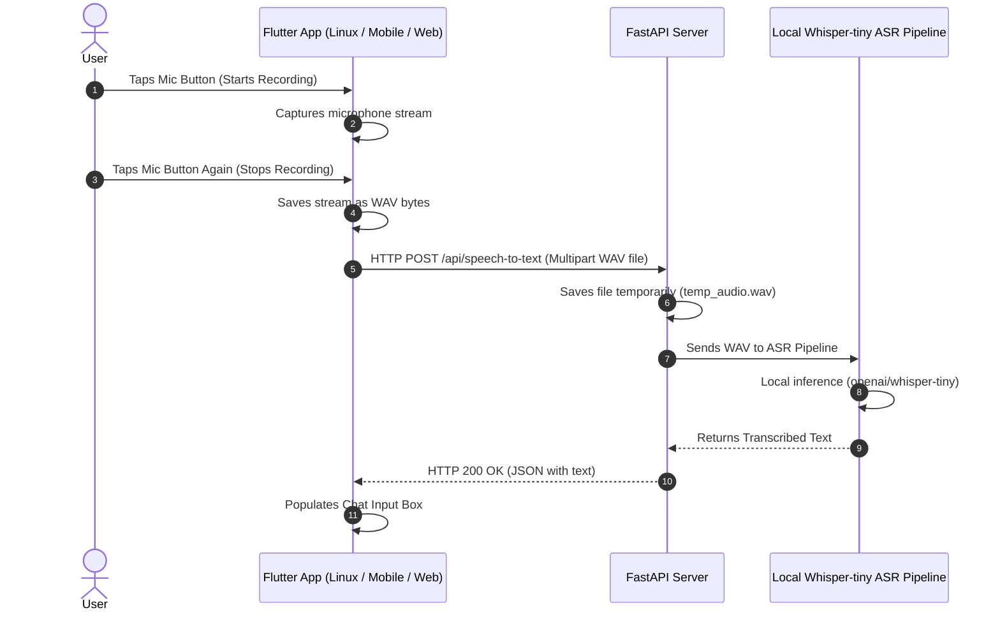

# EE471 Mini-Project 3: Local Speech-to-Text System Report

This report provides a comprehensive overview of the architecture, file structure, and implementation details for **Mini-Project 3 (RoboMunch)**. It details how the speech-to-text pipeline was migrated from the browser's native/cloud API to a fully local, server-side Automatic Speech Recognition (ASR) system.

---

## 1. Project Overview & Objective

The objective of this project is to implement a hybrid client-server application where the user can interact with the **RoboMunch AI Artist Studio** using voice commands. 

Rather than relying on external browser speech recognition services (like Chrome's Web Speech API, which sends audio to Google Cloud and varies across browsers), this project shifts the ASR pipeline to run **completely locally offline** on the backend using the **OpenAI Whisper-tiny** model via Hugging Face.

---

## 2. System Architecture

The project is structured around a classic **Client-Server Architecture**:



---

## 3. Directory & File Structure

Here is the layout of the project's codebase and what each file does:

```text
mini-project-3/
│
├── backend/                             # FastAPI Backend (Python)
│   ├── main.py                          # Main API entrypoint and routes
│   └── speech_to_text/
│       └── asr.py                       # Whisper model initialization & transcription
│
└── frontend_flutter/                    # Cross-Platform Frontend (Flutter / Dart)
    ├── pubspec.yaml                     # Project dependencies & configurations
    ├── android/ & ios/ & linux/         # Native platform project folders
    └── lib/
        ├── main.dart                    # Main UI and application controller
        └── audio_recorder/              # Cross-Platform Audio Recorder Module
            ├── audio_recorder.dart      # Platform-agnostic interface
            ├── audio_recorder_stub.dart # Stub implementation (Fallback)
            ├── audio_recorder_web.dart  # Web recording (uses dart:html)
            └── audio_recorder_io.dart   # Mobile/Desktop recording (uses record & path_provider)
```

---

## 4. File-by-File Breakdown

### A. Backend Files (Python)
#### 1. [`backend/speech_to_text/asr.py`](file:///home/tunac/projects-for-university/EE471/mini-project-3/backend/speech_to_text/asr.py)
* **Purpose**: Manages the local speech-to-text pipeline.
* **Details**: 
  * Loads the `openai/whisper-tiny` model using Hugging Face's `transformers` pipeline.
  * Automatically detects and utilizes a CUDA-capable GPU (`device=0`) if available, falling back to CPU (`device=-1`) for resource friendliness.
  * Exposes the `transcribe(audio_path)` function, which feeds the target WAV audio file to the model and extracts the transcribed text.

#### 2. [`backend/main.py`](file:///home/tunac/projects-for-university/EE471/mini-project-3/backend/main.py)
* **Purpose**: Exposes API endpoints for the client application.
* **Details**:
  * Hosts the `POST /api/speech-to-text` route.
  * Receives binary audio data uploaded via HTTP Multipart Form Data, saves it to a temporary file (`temp_audio.wav`), transcribes it using `asr.py`, and returns the text in a JSON structure: `{"text": "..."}`.

---

### B. Frontend Files (Flutter / Dart)
To support running on Web, Mobile, and Desktop without compile-time errors, we used **Conditional Imports** in Dart. Depending on the target platform, the compiler imports only the relevant file.

#### 1. [`frontend_flutter/lib/audio_recorder/audio_recorder.dart`](file:///home/tunac/projects-for-university/EE471/mini-project-3/frontend_flutter/lib/audio_recorder/audio_recorder.dart)
* **Purpose**: Defines the abstract interface for the audio recorder.
* **Details**: Uses `if (dart.library.html)` and `if (dart.library.io)` to conditionally import the web-specific or native-specific implementation.

#### 2. [`frontend_flutter/lib/audio_recorder/audio_recorder_web.dart`](file:///home/tunac/projects-for-university/EE471/mini-project-3/frontend_flutter/lib/audio_recorder/audio_recorder_web.dart)
* **Purpose**: Records audio inside browsers.
* **Details**: Uses the native HTML5 `MediaRecorder` and `getUserMedia` APIs via `dart:html` to stream and capture audio as raw WAV Blobs.

#### 3. [`frontend_flutter/lib/audio_recorder/audio_recorder_io.dart`](file:///home/tunac/projects-for-university/EE471/mini-project-3/frontend_flutter/lib/audio_recorder/audio_recorder_io.dart)
* **Purpose**: Records audio on Mobile (Android/iOS) and Desktop (Linux/Windows/macOS).
* **Details**: Uses the Flutter `record` package and `path_provider` to write mono, 16kHz WAV streams to the device's local temporary folder, and reads the raw file bytes on completion.

#### 4. [`frontend_flutter/lib/main.dart`](file:///home/tunac/projects-for-university/EE471/mini-project-3/frontend_flutter/lib/main.dart)
* **Purpose**: The main application view and application controller.
* **Details**: 
  * Controls the voice recording toggle button (`_toggleListening`). 
  * Handles permissions and UI updates during recording states (**"Listening..."** and **"Transcribing audio..."**).
  * Executes the HTTP request uploading the WAV bytes to the backend and places the result in the prompt input field.

---

## 5. Key Technical Implementations & Solving Challenges

1. **Local vs Cloud**: We replaced `speech_to_text` (browser-native cloud translation) with custom mic recording logic to force all voice inputs to route through the local `openai/whisper-tiny` model.
2. **Missing Dependencies on Linux**: Linux captures microphone data via PulseAudio's `parecord` tool. We installed `pulseaudio-utils` to provide the required OS binaries.
3. **Cross-Platform Compilation**: Standard Flutter packages often crash when building for Web or Desktop due to target library mismatches. Conditional imports (`audio_recorder_stub.dart`, `_web.dart`, `_io.dart`) guarantee it compiles everywhere.
4. **Namespace Collision**: Resolved class naming overlap between the custom interface `AudioRecorder` and the external package's `AudioRecorder` by aliasing the package dependency: `import 'package:record/record.dart' as rec;`.
